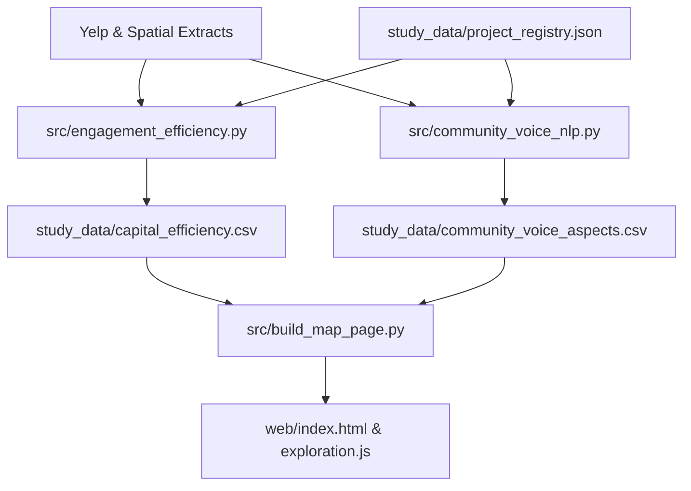

# Implementation Plan: Community Voice, Public Investment, and Capital Efficiency

**CIS 509 — Analytics for Unstructured Data** · Team 4  
**Date:** September 17, 2026  
**Document Status:** Approved architecture guiding subsequent implementation phases.

---

## 1. Empirical Hypotheses and Analytical Foundation

### 1.1 The Causal Transmission Chain and Reformulated Hypotheses
The Milestone 2 Exploratory Data Analysis (EDA) demonstrated that customer sentiment and star ratings do not systematically track public capital expenditure ($r \approx 0.00$, failed temporal placebo test). Yelp reviews are not a survey of resident happiness or a direct measure of municipal policy approval. Rather, **reviews are an observable digital proxy for commercial and foot-traffic interaction**.

The underlying economic and behavioral mechanism follows a 4-stage transmission chain:

$$\text{Public Capital Project} \;\xrightarrow{\text{crowding-in}}\; \text{Surrounding Commercial Investment} \;\xrightarrow{\text{foot traffic}}\; \text{Human Interaction} \;\xrightarrow{\text{behavioral trace}}\; \text{Review Engagement}$$

1. **Stage 1 (Public Capital Outlay):** A public entity commits place-based capital (e.g., greenway trail, civic plaza, riverfront park, transit line).
   - *Observed Metric:* Reported project capital cost in millions ($M) from official project accounts and FTA grants.
   - *Measurement Caveat:* Headline figures conflate federal grants, municipal bonds, and private match funds; public expenditures are not reconciled to audited contractor outlays.
2. **Stage 2 (Spillover & Surrounding Investment):** The public amenity encourages private and commercial investment in the immediate catchment (adaptive reuse of buildings, new storefronts, cafes, outdoor seating, park activation).
   - *Observed Metric:* Net active reviewed business participation contrast within 500m (`business_growth.csv`).
   - *Empirical Evidence:* Mixed across projects (Lafitte +5.4%, Riverfront +0.7%, Dilworth −17.6%, Sun Link −18.7%).
3. **Stage 3 (Physical Interaction & Foot Traffic):** More people visit, walk through, recreate in, and patronize the outcomes of those public and private investments.
   - *Measurement Caveat:* **Unobserved directly** in Yelp data (no pedestrian counter or cellular mobility telemetry). Check-in counts serve as the closest observable foot-traffic proxy; the conversion of visits into Yelp reviews is a structural behavioral assumption of this research design.
4. **Stage 4 (Observable Digital Voice & Engagement):** As foot traffic and patron interactions increase, a fraction of those interacting leave behavioral traces (reviews, tips, check-ins, photos) and articulate their experience of the surrounding neighborhood conditions.
   - *Observed Metric:* Matched difference-in-differences in review volume, unique reviewer counts, check-ins, and community voice topic shares.

Under this transmission mechanism, we test three operational hypotheses (reformulated post-EDA to replace the falsified direct spending $\rightarrow$ sentiment link):

1. **Hypothesis 1 (Community Voice):** Because reviews are behavioral traces of people interacting with places, unstructured text contains substantive commentary on physical surroundings, walkability, transit, cleanliness, and public space, alongside transactional food/service evaluations.
2. **Hypothesis 2 (Engagement Generation):** Publicly funded projects catalyze general investment and foot traffic in their surrounding catchment, generating measurable net increases in active reviewed businesses and review volume relative to matched counterfactual areas.
3. **Hypothesis 3 (Capital Non-Linearity: "More Dollars ≠ More Engagement"):** The four matched samples and Sun Link's full-route comparison show different descriptive review contrasts per dollar. Sun Link's 717-listing corridor has a −11.23 growth-adjusted reviews/$M score at 500m, while Lafitte's matched sample has +165.16 reviews/$M. Their methods differ, so they cannot support a common project ranking. With $N=5$ cases, project type is intertwined with geography, cost scale, and density.

### 1.2 Reconciliation with Milestone 2 EDA Hypothesis Scheme
The earlier Milestone 2 EDA deliverable (`ProjectEDA_Team4.ipynb` and `EDA_Evaluation.md`) evaluated an exploratory hypothesis scheme based on direct spending-to-sentiment correlations:
- **Milestone 2 H1:** Nearby business engagement increases after public investment.
- **Milestone 2 H2:** Review sentiment and star ratings improve near public investments.
- **Milestone 2 H3:** Benefits differ across local income groups.

The EDA and subsequent empirical checks decisively **rejected Milestone 2 H2** (the specification curve showed correlation $r$ was bounded near zero and failed the temporal placebo test, while customer stars showed no consistent shift across the five cases).

Consequently, the post-EDA framework **reformulated the hypothesis structure** around the 4-stage transmission mechanism ($H_1$ Community Voice in reviews, $H_2$ Engagement Generation / commercial spillover, $H_3$ Capital Non-Linearity: "More Dollars $\ne$ More Engagement"). Milestone 2 H3's equity analysis is preserved as Dimension 3 of the Public Investment Efficiency Score ($CE_{\text{lower}}$).

### 1.3 Grounding in EDA Evidence
| Project | Typology | Reported Cost ($M) | Relative Review Growth (500m) | Relative Business Growth (500m) | Baseline Local Income Contrast |
|---|---|---:|---:|---:|---|
| **Lafitte Greenway** (New Orleans) | Greenway / linear park | $9.1 | +34.5% (Main) / +26.3% (Lower band) | +5.4% | Robust positive growth concentrated in lower-income ZIPs (+26.3%). |
| **Riverfront / Ascend** (Nashville) | Riverfront park / venue | $52.0 | +64.2% (Unmatched) / +59.7% (Lower band) | +0.7% | High activity growth, but matched citywide growth leaves business participation flat (+0.7%). |
| **Dilworth Park** (Philadelphia) | Civic plaza / transit hub | $55.0 | +23.7% (All) / −4.1% (250m) | −17.6% | Sensitive to radius; driven by top 5% busiest establishments (contrast drops to +5.8% without them). |
| **Water Works Park** (Tampa) | Riverfront / spring restoration | $7.4 | Suppressed at 500m (2 pairs) / −44.8% at 1km | +69.2% (Raw) | Severe baseline sparsity (only 2 matched pairs); percentage contrasts uninterpretable without support indicators. |
| **Sun Link** (Tucson) | Streetcar / fixed transit | $196.5 | −16.8% full-route review-growth contrast (unmatched) | −18.7% | Reviews increased in absolute terms, but slower than the farther Tucson comparison. |

---

## 2. Mathematical Formulations and Estimands

### 2.1 Engagement Metrics Vector ($E$)
For a given business $i$ in period $p \in \{\text{pre}, \text{post}\}$:
$$E_{i, p} = \big[ Y_{i, p}^{\text{reviews}}, \; Y_{i, p}^{\text{reviewers}}, \; Y_{i, p}^{\text{checkins}}, \; Y_{i, p}^{\text{tips}} \big]$$

At the cohort/area level:
$$N_{p}^{\text{active}} = \sum_{i \in \mathcal{B}} \mathbb{I}(Y_{i, p}^{\text{reviews}} \ge 1)$$

### 2.2 Relative Engagement Growth ($\Delta E$)
For near cohort $\mathcal{N}$ and matched comparison cohort $\mathcal{C}$:
$$\text{Growth}_{\mathcal{N}} = \frac{\bar{Y}_{\mathcal{N}, \text{post}}}{\bar{Y}_{\mathcal{N}, \text{pre}}} - 1, \quad \text{Growth}_{\mathcal{C}} = \frac{\bar{Y}_{\mathcal{C}, \text{post}}}{\bar{Y}_{\mathcal{C}, \text{pre}}} - 1$$

$$\Delta E_{\text{rel}} = \left( \frac{\bar{Y}_{\mathcal{N}, \text{post}} / \bar{Y}_{\mathcal{N}, \text{pre}}}{\bar{Y}_{\mathcal{C}, \text{post}} / \bar{Y}_{\mathcal{C}, \text{pre}}} - 1 \right) \times 100$$

Alongside log-transformed contrast to mitigate extreme skew:
$$\Delta E_{\log} = \frac{1}{|\mathcal{P}|} \sum_{(i, j) \in \mathcal{P}} \left[ \big(\ln(1 + Y_{i, \text{post}}) - \ln(1 + Y_{i, \text{pre}})\big) - \big(\ln(1 + Y_{j, \text{post}}) - \ln(1 + Y_{j, \text{pre}})\big) \right]$$

### 2.3 Capital Efficiency Estimands ($CE$)
Because absolute review differences depend on baseline density while percentage differences can be unstable with sparse baselines, the app shows $CE_{\text{abs}}$ alongside support and comparison method. Rankings are meaningful only within a common method and adequately supported cohort.

1. **Primary Headline Metric: Absolute Matched Gain per \$1M Capital Outlay ($CE_{\text{abs}}$):**
   Measures net reviewer traffic added to the matched business sample per million dollars invested:
   $$CE_{\text{abs}} = \frac{\sum_{i \in \mathcal{N}} (Y_{i, \text{post}} - Y_{i, \text{pre}}) - \sum_{j \in \mathcal{C}} (Y_{j, \text{post}} - Y_{j, \text{pre}})}{\text{Cost (\$M)}} = \frac{|\mathcal{P}| \times \Delta \bar{Y}_{\text{DiD}}}{\text{Cost (\$M)}}$$

2. **Relative Growth Rate per \$1M Capital Outlay ($CE_{\text{rel}}$):**
   Measures the net percentage acceleration of nearby activity relative to control trend per million dollars:
   $$CE_{\text{rel}} = \frac{\Delta E_{\text{rel}}}{\text{Cost (\$M)}}$$

3. **Baseline-Normalized Capital Efficiency ($CE_{\text{norm}}$):**
   Normalizes net absolute review generation by the pre-existing baseline review volume of the near cohort:
   $$CE_{\text{norm}} = \frac{|\mathcal{P}| \times \Delta \bar{Y}_{\text{DiD}}}{\left(\sum_{i \in \mathcal{N}} Y_{i, \text{pre}}\right) \times \text{Cost (\$M)}} \times 100 = \frac{\Delta E_{\text{net}}}{\text{Baseline Volume} \times \text{Cost (\$M)}} \times 100$$

4. **Active Business Expansion per \$1M Capital Outlay ($CE_{\text{biz}}$):**
   Measures net reviewed business participation on Yelp within the 500m catchment per million dollars:
   $$CE_{\text{biz}} = \frac{\Delta N_{\mathcal{N}}^{\text{active}} - \left(N_{\mathcal{N}, \text{pre}}^{\text{active}} \times \text{Growth}_{\mathcal{C}}^{\text{biz}}\right)}{\text{Cost (\$M)}}$$

5. **Support and Display Invariant:**
   Ratios with $N_{\text{pairs}} < 20$ (specifically Water Works Park primary 500m with $N=2$) MUST be marked `low_support = True` and suppressed from ranking comparisons. No ratio may be presented without its underlying baseline counts.

Sun Link uses a separate full-route estimand: $\text{CE}_{\text{corridor}} = [Y_{\text{near,post}} - Y_{\text{near,pre}}(Y_{\text{far,post}}/Y_{\text{far,pre}})]/\text{cost}$. At 500m it uses all 717 Yelp listings and a farther 1.5–8 km area. The result is unmatched and must be labeled separately.

### 2.4 Community Voice Share ($CVS$)
To test Hypothesis 1, text is partitioned into Community Aspects ($\mathcal{A}_{\text{community}}$) vs. Transactional Aspects ($\mathcal{A}_{\text{commercial}}$):
- $\mathcal{A}_{\text{community}}$: Surroundings & Streetscape, Accessibility & Transit, Walkability & Bikeability, Cleanliness & Public Safety.
- $\mathcal{A}_{\text{commercial}}$: Food & Taste, Service & Speed, Product Quality, Price & Value.

For review $r \in \mathcal{R}$:
$$CVS = \frac{\sum_{r \in \mathcal{R}} \mathbb{I}(\exists a \in \mathcal{A}_{\text{community}} \text{ in } r)}{|\mathcal{R}|}$$
$$\Delta CVS = CVS_{\text{near, post}} - CVS_{\text{near, pre}} - \big(CVS_{\text{ctrl, post}} - CVS_{\text{ctrl, pre}}\big)$$

---

## 3. Architecture and Component Design

### 3.1 Data Contracts & Storage
1. **`study_data/project_registry.json` (Source of Truth):**
   - Project metadata, historical opening dates, official geometries, reported capital costs, coordinate reference systems (EPSG), and ACS baseline years.
2. **`study_data/capital_efficiency.csv`:**
   - Pre-computed $CE_{\text{reviews}}$, $CE_{\text{biz}}$, $\Delta E_{\text{rel}}$, $\Delta E_{\log}$, sample sizes, pair counts, and support flags across buffer radii (250m, 500m, 1000m) and income tiers.
3. **`study_data/community_voice_aspects.csv`:**
   - Aspect prevalence, aspect-specific sentiment distributions, sentence-level excerpts, and pre/post shifts for community vs. transactional terms.

### 3.2 Computational Modules (`src/`)
- **`src/engagement_efficiency.py`:**
  - Ingests `engagement.csv`, `business_growth.csv`, and `project_registry.json`.
  - Calculates point estimates, standard errors (clustered by business pair), and capital efficiency indices.
  - Emits `study_data/capital_efficiency.csv` and summary markdown tables.
- **`src/community_voice_nlp.py`:**
  - Implements rule-based and supervised aspect classifiers (integrating BERT/deep-learning representations aligned with CIS 509 Lab 3/4).
  - Validates negative recall and precision against a stratified audit sample of 500 reviews.
  - Extracts place-based discourse shifts before and after project completion.
- **`src/build_map_page.py` & `src/exploration.js`:**
  - Refactors front-end interface:
    1. Replaces ZCTA gross dollar explorer with **Project Capital Efficiency Benchmark**.
    2. Adds **Typology Comparison Matrix** (Greenway vs Plaza vs Transit vs Riverfront).
    3. Integrates **Community Voice Inspector** showing exact review excerpts where citizens discuss the public space.
    4. Enforces visual support guards (graying out or hatching under-supported estimates like Water Works Park).

### 3.3 Prospective Planning Tool: Reference-Case Scenario Explorer

The separate Capital Efficiency Studio (`web/model.html`) now shows a trained
research estimate from ten supported project outcomes, with leave-one-project-out
error beside it. It also applies one observed project as a transparent reference
case. Five projects supply the scenario types; the six expansion projects are used
only in the uniformly defined trained outcome table, with center-proxy geometry
explicitly flagged. The trained model is not accurate enough for budget or site
recommendations.

The user selects a reference project type, catchment radius (250, 500, or 1,000 m),
income group, proposed cost, target ZIP, and a local business count. Four references
use the observed matched review difference per business. Sun Link uses a full-route,
unmatched difference per Yelp listing after adjusting for farther-area growth. Scenario arithmetic is:

$$\text{Illustrative net review difference} = N_{\text{businesses}} \times \Delta \bar{Y}_{\text{DiD}}$$
$$\text{Illustrative CE}_{\text{abs}} = \frac{N_{\text{businesses}} \times \Delta \bar{Y}_{\text{DiD}}}{\text{proposed cost (\$M)}}$$

A ZIP selection displays Census population and all-ZIP Yelp listing/review context.
It does not automatically alter the score: the full-ZIP count is not a measured
project catchment, and five cases cannot isolate an independent location effect.
Adequate matched or baseline support must exist for the selected subgroup; otherwise
no score is displayed. The page also shows how the same proposed cost and business
count would score under each available reference radius. These are sensitivity
comparisons, not confidence intervals.

---

## 4. Threats to Validity and Risk Controls

| Risk / Threat | Observed in EDA | Control / Mitigation Strategy |
|---|---|---|
| **Under-supported Baselines** | Water Works Park had only 2 baseline matched pairs; raw % changes spike deceptively (+250%). | Hard minimum support threshold ($N_{\text{pairs}} \ge 20$). Display raw counts alongside rates; suppress ratio contrasts below threshold with explicit visual flags. |
| **Skew and Top-5% Outliers** | Dilworth Park growth is dominated by high-volume Center City restaurants; contrast drops from +23.7% to +5.8% without them. | Report log-transformed contrasts ($\Delta E_{\log}$) alongside raw arithmetic sums; compute Winsorized and trimmed bounds. |
| **Yelp Population vs. Business Openings** | An increase in active Yelp listings does not guarantee new business births (could be Yelp platform adoption). | Strictly define metric as *reviewed business participation on Yelp*, not *business formation*. |
| **Unreconciled Cost Scopes** | Headline costs conflate public grants with private match funding (e.g. Dilworth $55M mixed, Sun Link $196.5M FTA+local). | Document source ledgers in registry; run sensitivity against public-only funding shares. |
| **Confounding with Wider Metro Growth** | Review volume grew across study cities. | Use matched controls for four original cases. Label Sun Link's full-route growth adjustment as unmatched and descriptive. |
| **Scenario Extrapolation Overreach** | Applying a single project's observed DiD spread to a hypothetical corridor assumes transferable commercial elasticity. | Strictly label tool as an illustrative *Scenario Explorer* based on $N=5$ cases; display source project $N=1$ badge and report ranges, never point forecasts. |

---

## 5. Implementation Roadmap and Verification Plan

### Phase 1: Capital Efficiency Engine (`src/engagement_efficiency.py`)
- **Objective:** Implement reproducible capital efficiency calculations across all 5 study cases.
- **Deliverables:**
  - `src/engagement_efficiency.py` script.
  - `study_data/capital_efficiency.csv`.
  - CLI reporting tool producing tabular benchmarks.
- **Verification:** Unit tests confirming mathematical identities, handle zero denominators, and match baseline EDA figures.

### Phase 2: Community Voice NLP Engine (`src/community_voice_nlp.py`)
- **Objective:** Separate community/amenity voice from commercial service commentary.
- **Deliverables:**
  - Rule-based multi-label aspect tagger for `community_voice` vs. `commercial_voice`.
  - Sentence extraction module gathering qualitative evidence for the web UI.
  - Calibration test suite covering parser syntax and edge cases.
- **Verification & Status:** Rule-based parser operational and tested; formal human precision/recall audit on a stratified 500-review sample remains an open pending milestone item.

### Phase 3: Web Visualization & Map Refactor (`src/build_map_page.py`, `exploration.js`)
- **Objective:** Deliver interactive exploration of project efficiency, catchments, and community discourse.
- **Deliverables:**
  - Updated `web/index.html` featuring project locator, efficiency rankings, and voice excerpts.
  - Self-contained, offline-renderable map artifact ($\le 4$ MB, current 3.60 MB).
- **Verification:** Headless Puppeteer render check; verified offline rendering; dynamic FLAG badge assignment; zero broken assets.

### Phase 4: Trained CE Prototype and Reference Scenario (`src/train_ce_model.py`, `src/build_model_page.py`, `web/model.html`)
- **Objective:** Show the fitted CE research estimate and its held-out error beside transparent source-project arithmetic.
- **Deliverables:**
  - Interactive controls for proposed cost ($M), five project types, 196 mapped target ZCTAs, radius, income group, a user-entered local business or route-listing count, and editable near/comparison review trends.
  - Single-case reference arithmetic with the selected method, source reset, break-even growth control, support guard, and a three-radius sensitivity comparison.
  - Companion observed reviewed-listing participation and review-language diagnostics, kept separate from CE because they use different cohorts and units.
  - Explicit distinction between target ZIP context and the local business count used in the calculation.
- Ridge regression trained on ten supported project outcomes with only pre-opening Yelp activity and proposed cost as inputs. The 717-listing Sun Link full-route outcome is retained. One project with only six baseline-reviewed businesses is excluded.
- **Verification:** Leave-one-project-out CE mean absolute error is 56.3 reviews/$1M versus 69.0 for a mean-only baseline; CE direction is correct for six of ten projects. Generated-page and numerical checks pass, and the page was inspected in the local browser. The model remains unsuitable for budget or site recommendations.

### Phase 5: Final Synthesis & Coursework Artifacts
- **Objective:** Produce a reproducible course notebook that reports both findings and model limits.
- **Deliverables:**
  - Executed [Final Submission Report](coursework/final-project/Final_Submission_Report.ipynb) with 11-project EDA, project-held-out CE regression, and a business-held-out TF–IDF sentiment classification comparison.
  - Rendered HTML report available from the local studio. A presentation should emphasize observed patterns and held-out failures rather than municipal capital allocation recommendations.

---

## 6. Dataset Expansion: Candidate Cases, Verification Protocol, and Executed Metrics

To move beyond the initial $N=5$ cases and establish multi-observation reference classes, the system executed a single-pass streaming extraction over all 6,990,280 reviews in `Yelp JSON/yelp_dataset.tar` (`src/extract_expansion_projects.py`), computing business growth and capital efficiency for six expanded investments (`study_data/expansion_projects_metrics.csv`):

### 6.1 Tier 1 Expansion: Existing 5-Metro Panel (Zero New Raw Extraction)
These candidates sit inside the already extracted 277 study ZIPs and 5-metro review panel (`reviews_5metro.csv`). They require only spatial boundary definition and registry verification:

| Candidate Project | Metro & State | Catchment Density | Known Opening Milestone | Reported Cost Baseline | Methodological Value |
|---|---|---:|---|---:|---|
| **Tampa Riverwalk** (Central / Kennedy Plaza) | Tampa, FL | **227 businesses** in 500m (ZIP 33602) | Phased; central milestone 2015 | ~$32.0M total ($10.9M TIGER grant + city CIP) | **Solves Tampa's $N=2$ suppression.** Water Works Park was on the sparse northern tip; central Riverwalk provides a dense urban waterfront promenade. |
| **The Rail Park (Phase 1)** | Philadelphia, PA | **291 businesses** in 500m (ZIPs 19123, 19107) | June 2018 | ~$10.3M ($3.5M state RACP + private match) | Adds a quarter-mile elevated viaduct linear trail in Callowhill with dense commercial Yelp coverage. |
| **Schuylkill Banks Boardwalk** | Philadelphia, PA | **140 businesses** in 500m (ZIPs 19103, 19146) | October 2014 | ~$18.0M ($13.0M TIGER grant) | 2,000-foot over-water pedestrian boardwalk extending the Schuylkill River Trail in Center City West. |
| **Crescent Park** | New Orleans, LA | **57 businesses** in 500m (ZIP 70117, Bywater) | July 2014 | ~$31.2M | 1.4-mile linear riverfront park in Bywater/Marigny. *Note: 57 raw listings may yield thin matched pairs (<20) at 500m, requiring 1,000m buffer (207 businesses).* |

### 6.2 Tier 2 Expansion: New Metro Ingestion (from `yelp_dataset.tar`)
The on-disk raw Yelp dataset (150,346 businesses) covers several additional US metropolitan areas featuring landmark TIGER and urban infrastructure investments:

| Candidate Project | Metro & State | Total Metro Pool | Known Opening Milestone | Reported Cost Baseline | Methodological Value |
|---|---|---:|---|---:|---|
| **Indianapolis Cultural Trail** | Indianapolis, IN | 7,540 businesses in IN | May 2013 | ~$63.0M ($20.5M federal TIGER grant + private) | **National gold standard for urban greenways.** 8-mile bicycle/pedestrian trail downtown; 459 Yelp businesses within 500m. |
| **Gateway Arch Park (CityArchRiver)** | Saint Louis, MO | 6,082 businesses in MO | 2015–2018 | ~$380.0M public-private project | Reconnected downtown St. Louis to the riverfront over I-44 highway lid; 300+ downtown establishments. |
| **Truckee Riverwalk & Bridge** | Reno, NV | 5,935 businesses in NV | April 2016 | ~$18.3M | Downtown pedestrian bridge and riverwalk corridor. |

### 6.3 Five-Gate Verification Protocol for New Project Additions
To maintain statistical integrity and prevent arbitrary selection or cherry-picking, any candidate project MUST clear five verification gates before entering the registry:
1. **Documented Physical Footprint:** Official GIS line or polygon from municipal plans or OpenStreetMap (not an agency headquarters or mailing address).
2. **Sourced Capital Outlay Ledger:** Capital cost sourced directly from official municipal CIP budget books, FTA grant notices, or agency annual reports.
3. **Grounded Opening Milestone:** Explicit completion date for the specific funded segment, with phased milestones documented.
4. **Pre/Post Window Separation:** Two full calendar years before construction and two full calendar years after opening (excluding active construction years).
5. **Sample Support Gate:** Must achieve $\ge 20$ matched business pairs within the 500m buffer; otherwise flagged as `low_support = True` and suppressed from primary ranking.
